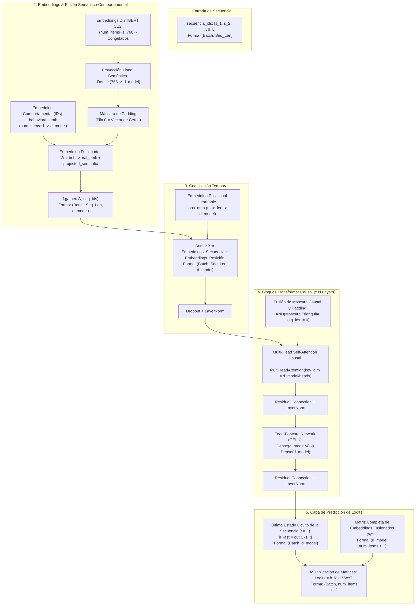

# Estructura del Proyecto y Arquitectura de la Red Neuronal (H-BEST)

Este documento sirve como guía técnica para comprender el propósito de cada archivo del repositorio, el flujo de datos del sistema de recomendación híbrido secuencial **H-BEST**, la estructura matemática y computacional de su arquitectura neuronal, y el cálculo de dispersión (*sparsity*) implementado.

---

## 📁 1. Guía de Archivos del Proyecto

A continuación se detalla la función específica de cada archivo del repositorio:

| Archivo | Tipo | Descripción |
| :--- | :---: | :--- |
| **[`main.py`](file:///c:/Users/Slendy%20Grisales/RECOMMENDER-SYSTEMS---FINAL-PROJECT/main.py)** | Orquestador principal | Script central que ejecuta todo el flujo: carga datos, genera secuencias, extrae embeddings BERT (o carga caché), entrena secuencialmente el **Baseline** y **H-BEST**, evalúa el conjunto de prueba con 9 métricas, genera la tabla comparativa final e imprime recomendaciones demo. |
| **[`model.py`](file:///c:/Users/Slendy%20Grisales/RECOMMENDER-SYSTEMS---FINAL-PROJECT/model.py)** | Modelos y Capas | Contiene la implementación en TensorFlow/Keras de `HBESTModel`, `BaselineModel` (SASRec equivalente) y la capa personalizada `TransformerEncoderBlock` para auto-atención causal. |
| **[`data_utils.py`](file:///c:/Users/Slendy%20Grisales/RECOMMENDER-SYSTEMS---FINAL-PROJECT/data_utils.py)** | Preprocesamiento | Funciones para cargar reseñas de Steam, filtrar interacciones mínimas, extraer descripciones textuales por juego, codificar IDs numéricos, dividir en *leave-one-out time-based split* (Train, Val, Test) y generar los `tf.data.Dataset`. |
| **[`distilbert_extractor.py`](file:///c:/Users/Slendy%20Grisales/RECOMMENDER-SYSTEMS---FINAL-PROJECT/distilbert_extractor.py)** | Extractor BERT | Implementa `DistilBERTExtractor`, el cual carga `TFDistilBertModel` desde Hugging Face, congela sus pesos y genera embeddings densos de 768 dimensiones de los textos de los juegos procesando el token especial `[CLS]`. |
| **[`recommend_utils.py`](file:///c:/Users/Slendy%20Grisales/RECOMMENDER-SYSTEMS---FINAL-PROJECT/recommend_utils.py)** | Recomendaciones | Contiene funciones de utilidad listas para producción: predicción de ítems para un usuario, lista Top-K para batches de usuarios, búsqueda de usuarios similares y búsqueda de ítems similares por similitud de coseno en embeddings (Behavioral, Semantic o Fused). |
| **[`evaluate.py`](file:///c:/Users/Slendy%20Grisales/RECOMMENDER-SYSTEMS---FINAL-PROJECT/evaluate.py)** | Métricas y Curvas | Implementa el cálculo de métricas de ranking (`Accuracy`, `HR@K`, `NDCG@K`, `Precision@K`, `Recall@K`) y la función `plot_training_validation_curves` para guardar las gráficas de pérdida y métricas en disco. |
| **[`train.py`](file:///c:/Users/Slendy%20Grisales/RECOMMENDER-SYSTEMS---FINAL-PROJECT/train.py)** | Lazo de Entrenamiento | Define la función de pérdida por entropía cruzada secuencial con enmascaramiento (`compute_masked_loss`), el cálculo de pérdida de validación por época (`compute_val_loss`) y el lazo de entrenamiento (`train_model`) con parada temprana lógica y restauración de mejores pesos. |
| **[`demo_recommend.py`](file:///c:/Users/Slendy%20Grisales/RECOMMENDER-SYSTEMS---FINAL-PROJECT/demo_recommend.py)** | Demostración | Script ejecutable rápido que demuestra de forma interactiva las 4 funcionalidades clave de recomendación y similitud utilizando un entrenamiento ágil de 3 épocas. |
| **[`verify_paso1_tf.py`](file:///c:/Users/Slendy%20Grisales/RECOMMENDER-SYSTEMS---FINAL-PROJECT/verify_paso1_tf.py)** | Test Unitario 1 | Verifica el pipeline de datos en TensorFlow, el correcto leave-one-out temporal, la codificación de IDs, y la densidad y dispersión del dataset filtrado. |
| **[`verify_paso2_tf.py`](file:///c:/Users/Slendy%20Grisales/RECOMMENDER-SYSTEMS---FINAL-PROJECT/verify_paso2_tf.py)** | Test Unitario 2 | Realiza una codificación semántica de prueba sobre un lote reducido de ítems usando DistilBERT en TensorFlow, verificando las dimensiones de los embeddings. |
| **[`verify_paso3_tf.py`](file:///c:/Users/Slendy%20Grisales/RECOMMENDER-SYSTEMS---FINAL-PROJECT/verify_paso3_tf.py)** | Test Unitario 3 | Instancia los modelos `HBESTModel` y `BaselineModel` con datos artificiales y verifica que el flujo delantero (forward pass) y la propagación de gradientes funcionen correctamente. |
| **[`setup_env.py`](file:///c:/Users/Slendy%20Grisales/RECOMMENDER-SYSTEMS---FINAL-PROJECT/setup_env.py)** | Entorno Local | Script automotor que descarga e instala Python 3.12.8 Embeddable, configura `pip` e instala las dependencias de TensorFlow y Hugging Face de forma local en la carpeta `python_env/`. |
| **[`setup_env.ps1`](file:///c:/Users/Slendy%20Grisales/RECOMMENDER-SYSTEMS---FINAL-PROJECT/setup_env.ps1)** | Orquestador PowerShell | Script de conveniencia para automatizar el aprovisionamiento del entorno Python de forma aislada en Windows. |

---

## 🧠 2. Estructura y Arquitectura de la Red Neuronal

El modelo estrella de este proyecto es **H-BEST (Hybrid BERT-Enhanced Sequential Transformer Recommender)**. El modelo está diseñado para combinar patrones de co-ocurrencia colaborativos (embeddings clásicos de ID) con características semánticas contextuales del texto (embeddings de DistilBERT preentrenados y proyectados), inyectándolos en un codificador Transformer causal autoregresivo.

### 2.1 Flujo de Arquitectura Neuronal de H-BEST



### 2.2 Formulación Matemática Detallada

#### Fase 1: Fusión Semántica
Para cada juego $j$ en el catálogo:
1. Se extrae su embedding estático de DistilBERT $\mathbf{e}_j^{bert} \in \mathbb{R}^{768}$.
2. Se proyecta a la dimensionalidad interna del Transformer ($d_{model}$):
   $$\mathbf{e}_j^{sem} = \mathbf{e}_j^{bert} \mathbf{W}_{proj} + \mathbf{b}_{proj} \in \mathbb{R}^{d_{model}}$$
3. Se suma linealmente al embedding colaborativo de comportamiento ID aprendido:
   $$\mathbf{w}_j = \mathbf{e}_j^{behav} + \mathbf{e}_j^{sem}$$
   *(Nota: Se garantiza que $\mathbf{w}_0 = \mathbf{0}$ para evitar que los tokens de relleno sesguen el modelo).*

#### Fase 2: Codificación Posicional y Dropout
La entrada secuencial del usuario $S_u = [s_1, s_2, ..., s_L]$ se mapea y se le suma una codificación posicional temporal paramétrica:
$$\mathbf{x}_t = \mathbf{w}_{s_t} + \mathbf{p}_t$$
$$\mathbf{z} = \text{LayerNorm}(\text{Dropout}(\mathbf{x}))$$

#### Fase 3: Auto-Atención con Máscara Causal
Para evitar que el modelo use información de interacciones futuras de la secuencia (*look-ahead bias*), se calcula la auto-atención sobre las matrices de Queries ($Q$), Keys ($K$) y Values ($V$) proyectadas desde $\mathbf{z}$:
$$\text{Attention}(Q, K, V) = \text{softmax}\left(\frac{Q K^T}{\sqrt{d_k}} + M\right) V$$
Donde $M \in \{0, -\infty\}^{L \times L}$ es la máscara lógica causal triangular:
$$M_{i, j} = \begin{cases} 0 & \text{si } i \ge j \\ -\infty & \text{si } i < j \end{cases}$$
Adicionalmente, se integra en la máscara lógica a nivel de lote un enmascaramiento para ignorar los tokens de padding (`seq_ids == 0`).

#### Fase 4: Predicción por Producto Punto
Para predecir el siguiente ítem más probable en la secuencia, se extrae el vector representativo final del Transformer $\mathbf{h}_{last} = \mathbf{h}_L \in \mathbb{R}^{d_{model}}$. Se calcula la similitud con todos los posibles candidatos del catálogo:
$$\hat{\mathbf{y}}_u = \mathbf{h}_{last} W^T \in \mathbb{R}^{N_{items}+1}$$
Donde $W$ es la matriz fusionada completa de embeddings.

### 2.3 Diferencias con el Baseline (SASRec)
El modelo **Baseline** tiene exactamente la misma arquitectura secuencial Transformer con máscara causal, pero prescinde de los embeddings semánticos de BERT:
$$\mathbf{w}_j = \mathbf{e}_j^{behav}$$
Esto hace que el Baseline dependa exclusivamente de patrones de co-ocurrencia colaborativos puros.

---

## 📈 3. Densidad y Dispersión del Dataset (*Sparsity*)

En sistemas de recomendación, la **dispersión** (*sparsity*) es una métrica fundamental para calificar cuán vacío está el dataset (la escasez de interacciones observadas). Mide la fracción de celdas nulas en la matriz de interacción hipotética de usuarios por ítems.

### 3.1 Formulación Matemática

Sea:
*   $U$ el conjunto de usuarios únicos (usuarios activos filtrados).
*   $I$ el conjunto de ítems únicos (juegos en el catálogo).
*   $N_{interactions}$ el número total de interacciones registradas tras el filtro (filas de datos).

La **Densidad** de la matriz de interacciones se calcula como:
$$\text{Density} = \frac{N_{interactions}}{|U| \times |I|}$$

La **Dispersión** (*Sparsity*) es el complemento de la densidad:
$$\text{Sparsity} = 1 - \text{Density} = 1 - \frac{N_{interactions}}{|U| \times |I|}$$

### 3.2 Implementación del Cálculo

El cálculo se realiza en tiempo real en los scripts [main.py](file:///c:/Users/Slendy%20Grisales/RECOMMENDER-SYSTEMS---FINAL-PROJECT/main.py) y [verify_paso1_tf.py](file:///c:/Users/Slendy%20Grisales/RECOMMENDER-SYSTEMS---FINAL-PROJECT/verify_paso1_tf.py) utilizando el siguiente algoritmo en Python:

```python
num_users = len(user_to_id)
num_items = len(item_to_id)
num_interactions = len(df_filtered)

# Densidad y Dispersión
sparsity = 1.0 - (num_interactions / (num_users * num_items))

print(f" -> Densidad del dataset: {(1.0 - sparsity) * 100:.4f}%")
print(f" -> Sparsity (Dispersión): {sparsity * 100:.4f}%")
```

> [!NOTE]
> En nuestro dataset de Steam preprocesado con al menos 5 interacciones por usuario, los valores reales arrojados son:
> *   **Usuarios activos ($|U|$):** 1,172
> *   **Juegos únicos ($|I|$):** 343
> *   **Interacciones ($N_{interactions}$):** 10,347
> *   **Densidad:** `2.5739%` (las interacciones observadas ocupan el 2.57% de la matriz).
> *   **Sparsity (Dispersión):** `97.4261%` (el 97.43% de las celdas de la matriz de interacciones de usuario-juego están vacías, lo cual es normal en recomendadores reales y justifica el uso de Transformers secuenciales y embeddings semánticos para generalizar).
