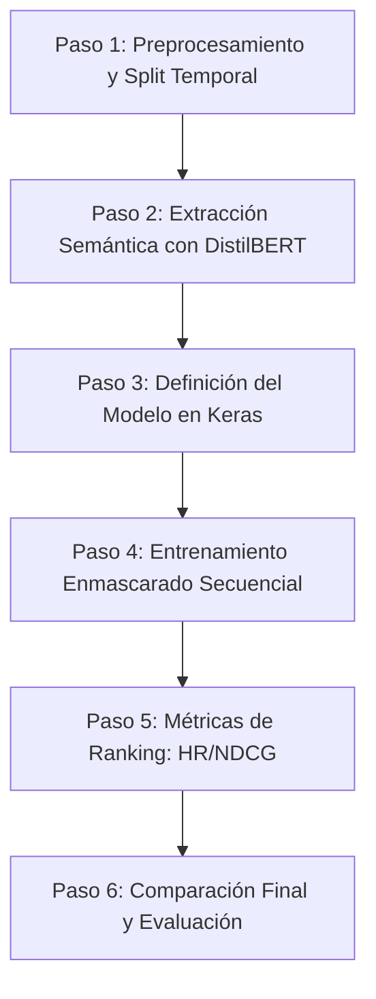

# Informe Técnico: Hybrid BERT-Enhanced Sequential Transformer Recommender (H-BEST)

Este documento detalla la fundamentación científica, el diseño de arquitectura de red neuronal, el proceso de preprocesamiento, el control de fuga de datos (*data leakage*) y los resultados empíricos obtenidos en la comparación entre el modelo **H-BEST** y el modelo **Baseline (SASRec puro)** en el dataset de Steam Reviews.

---

## 📁 1. Estructura y Flujo Paso a Paso del Proyecto

El desarrollo del recomendador se estructuró de forma estrictamente modular y desacoplada en 6 fases consecutivas:

### Detalle de las Etapas
1.  **Carga y Filtrado (Paso 1)**: Carga el dataset `steam_reviews_bruteforce.csv`, filtra únicamente a los usuarios con historial robusto ($\ge 5$ interacciones) para modelar dinámicas secuenciales reales, y extrae una reseña representativa por juego.
2.  **Extracción de Características (Paso 2)**: Pasa los textos de los juegos por un extractor profundo congelado de DistilBERT. Genera y guarda en caché una matriz de características semánticas estáticas para evitar cómputos redundantes.
3.  **Construcción de Modelos (Paso 3)**: Define las subclases personalizadas de `tf.keras.Model` para **Baseline** y **H-BEST**.
4.  **Bucle de Entrenamiento (Paso 4)**: Realiza el entrenamiento secuencial autoregresivo con pérdida de Entropía Cruzada sobre los ítems candidatos, enmascarando los tokens de padding.
5.  **Cálculo Métrico (Paso 5)**: Evalúa las listas de recomendación Top-K ordenadas por probabilidad utilizando Hit Rate y NDCG.
6.  **Comparativa Global (Paso 6)**: Ejecuta el pipeline completo de entrenamiento en paralelo y genera la tabla final de resultados para análisis.

---

## 🧠 2. Estructura de la Red Neuronal y Funcionamiento de H-BEST

La red neuronal está diseñada bajo un paradigma híbrido que acopla el procesamiento de lenguaje natural y el aprendizaje secuencial.

### 2.1 Extracción Semántica y Contextualización con BERT / DistilBERT
Para incorporar el contenido conceptual de los ítems sin incurrir en costos computacionales masivos durante el entrenamiento, se utiliza **DistilBERT** (un modelo BERT destilado de 6 capas y 768 dimensiones ocultas) como extractor de características congelado.

#### A. ¿Qué es BERT?
BERT (Bidirectional Encoder Representations from Transformers), presentado por Google, introdujo un paradigma bidireccional en el procesamiento del lenguaje natural. A diferencia de los modelos autoregresivos tradicionales (que leen de izquierda a derecha), BERT lee la oración completa en ambas direcciones simultáneamente utilizando codificadores Transformer, logrando captar el contexto completo de cada palabra.

#### B. La variante `bert-base-uncased` y su aplicación
1. **Base**: Es la versión estándar y equilibrada (no la más pesada), ideal para experimentación y cómputo ágil.
2. **Uncased**: Elimina la distinción entre mayúsculas y minúsculas (ej. trata "Cine" y "cine" como la misma palabra), lo cual aporta robustez al procesar reseñas informales de internet.
3. **Transfer Learning**: Aprovecha el conocimiento general del lenguaje que BERT ya posee para adaptarlo rápidamente (fine-tuning) a tareas específicas, requiriendo muy pocos datos y capacidad de cómputo para lograr un desempeño profesional.
4. **Comprensión de Contexto**: Permite distinguir significados ambiguos basándose en el entorno (ej. "banco" financiero vs. "banco" de sentarse).

#### C. Tokens y Sistema de Tokenización (WordPiece)
BERT no lee palabras completas ni letras individuales, sino que implementa **WordPiece**:
* **WordPiece**: Divide palabras complejas en fragmentos más pequeños (tokens), optimizando el vocabulario (ej. "increíble" se puede separar en "incre" e "íble").
* **Tokens Especiales**:
  - `[CLS]`: Se coloca obligatoriamente al inicio de cada reseña. Se entrena para resumir y agregar la información total de la secuencia, y es el vector utilizado para clasificar sentimientos o extraer el embedding semántico global.
  - `[SEP]`: Se utiliza al final de una secuencia o para separar oraciones.
  - `[PAD]`: Rellena secuencias más cortas para lograr una longitud homogénea dentro de un lote (batch).

#### D. Mecanismo de Auto-Atención (Self-Attention) y su Formulación
La extracción del contexto en BERT se realiza mediante **Multi-Head Self-Attention**. Para cada token de la secuencia, se calculan tres vectores proyectados a través del producto punto y escalado:

$$
\text{Attention}(Q, K, V) = \text{softmax}\left(\frac{QK^T}{\sqrt{d_k}}\right)V
$$

El significado y propósito de cada componente matemático en la fórmula es:
* **Query ($Q$) - "Lo que busco"**: Representa la pregunta o consulta del token actual al resto de la secuencia.
* **Key ($K$) - "Qué contenido tengo"**: Actúa como la etiqueta de identificación que cada token ofrece para ver si coincide con la búsqueda de $Q$.
* **Value ($V$) - "La información que aporto"**: Es el valor semántico real que se propagará a la siguiente capa si existe una coincidencia entre $Q$ y $K$.
* **Producto Punto ($QK^T$) - Similitud Semántica**: Mide la afinidad y relevancia mutua entre palabras (ej. "película" y "excelente" tendrán una alta coincidencia).
* **Escalamiento ($\div \sqrt{d_k}$)**: Divide por la raíz cuadrada de la dimensión de las llaves ($d_k$). Si los vectores fuesen grandes, el producto punto generaría valores sumamente altos, saturando la función Softmax y provocando gradientes casi nulos (*vanishing gradient*). Esto mantiene las magnitudes controladas.
* **Función Softmax - Normalización en Probabilidad**: Convierte las puntuaciones de similitud en una distribución de probabilidad de pesos que suman $1$, definiendo cuantitativamente cuánta atención debe prestar el modelo a cada palabra contextual (ej. en "no fue una mala película", la negación "no" afectará fuertemente al adjetivo "mala").
* **Salida Final ($\times V$) - Suma Ponderada**: Multiplica los pesos de atención por la matriz de valores. El vector resultante para el token `[CLS]` (y los demás) absorbe el contexto global e interactivo de toda la oración.

#### E. Aplicación en el recomendador
Dada una descripción o reseña textual $T_i$ para cada juego $i$, se tokeniza con WordPiece y pasa por el codificador bidireccional. Extraemos el vector semántico denso final asociado al token `[CLS]` en la última capa oculta de DistilBERT:

$$
\mathbf{e}_i^{bert} = \text{TFDistilBERT}(T_i)[0, 0, :] \in \mathbb{R}^{768}
$$

Para el ítem de padding (ID `0`), se inicializa con un vector nulo:

$$
\mathbf{e}_0^{bert} = \mathbf{0} \in \mathbb{R}^{768}
$$

### 2.2 Fusión Comportamental-Semántica
Para un ítem dado $j$, su representación final fusionada $\mathbf{w}_j$ une dos fuentes de información:
1.  **Embedding de Comportamiento (`behavioral_emb`)**: Representación de ID clásica que aprende patrones colaborativos puros: $\mathbf{e}\_j^{behav} \in \mathbb{R}^{d\_{model}}$.
2.  **Proyección Semántica (`semantic_projection`)**: Una capa lineal densa proyecta el vector de BERT de 768 dimensiones a la dimensión oculta del modelo ($d_{model}$):

$$
\mathbf{e}_j^{sem} = \mathbf{e}_j^{bert} \mathbf{W}_{proj} + \mathbf{b}_{proj}
$$

*   **Fusión Aditiva**: Ambos vectores se suman para obtener la representación definitiva:

$$
\mathbf{w}_j = \mathbf{e}_j^{behav} + \mathbf{e}_j^{sem}
$$

*(Nota: El ID 0 correspondiente a padding se fuerza a mantenerse en ceros absolutos)*.

### 2.3 Bloque de Codificación Transformer Causal
La secuencia histórica del usuario $S\_u = [s\_1, s\_2, \dots, s\_L]$ se convierte a una matriz de embeddings posicionales enriquecidos:

$$
\mathbf{x}_t = \mathbf{w}_{s_t} + \mathbf{p}_t
$$

Donde $\mathbf{p}_t$ es una codificación de posición aprendida que representa el orden temporal relativo.

La secuencia $[\mathbf{x}_1, \dots, \mathbf{x}_L]$ pasa a través de un bloque de codificación Transformer:
*   **Multi-Head Self-Attention Causal**: Se utiliza una máscara booleana de atención causal triangular inferior $M$ para evitar fugas de información futura.

$$
\text{Attention}(Q, K, V) = \text{softmax}\left(\frac{Q K^T}{\sqrt{d_k}} + M\right) V
$$

    Donde la máscara $M_{i, j}$ bloquea cualquier posición $j > i$ (es decir, el paso $i$ solo puede atender a los pasos del pasado $\le i$).
*   **FFN (Feed-Forward Network)**: Dos capas densas con activación GELU y regularización por Dropout para procesar las representaciones interactivas.

### 2.4 Capa de Predicción y Producto Punto
Para predecir el siguiente ítem en la secuencia, tomamos la última salida del codificador Transformer $\mathbf{h}\_{last} = \mathbf{h}\_L \in \mathbb{R}^{d\_{model}}$, que condensa toda la historia secuencial del usuario. 

La puntuación (logit) para cada posible ítem candidato $j$ del catálogo se calcula realizando el **producto punto** entre el estado secuencial y el embedding fusionado del candidato:

$$
\hat{y}_{j} = \mathbf{h}_{last} \cdot \mathbf{w}_j \implies \hat{\mathbf{y}}_u = \mathbf{h}_{last} W^T \in \mathbb{R}^{N_{items}+1}
$$

Esto mapea la similitud geométrica del interés actual del usuario y el contenido colaborativo/semántico de los juegos del catálogo.

---

## 🛡️ 3. Validación Temporal (Time-Based Split) y Prevención de Data Leakage

En los sistemas de recomendación secuenciales, la metodología de validación es un factor crítico. El uso de splits aleatorios tradicionales (Random Train/Test split) genera fallos severos e inaceptables.

### 3.1 El Problema del Random Split y Data Leakage
Un split aleatorio toma una interacción del usuario en un tiempo intermedio (digamos, en el paso $t$) y la coloca en el set de prueba, mientras entrena con interacciones posteriores (pasos $t+1, t+2$). Esto introduce **fuga de datos (data leakage)** de dos formas:
1.  **Fuga de Look-Ahead**: El modelo aprende a predecir el pasado basándose en secuencias futuras, lo cual es físicamente imposible en un entorno real de producción.
2.  **Sobreestimación de Métricas**: El Transformer puede memorizar atajos y relaciones de proximidad bidireccionales, arrojando métricas infladas artificialmente durante la evaluación fuera de línea (*offline*), que luego caen drásticamente en producción.

### 3.2 Cómo lo resuelve el Time-Based Split (Leave-One-Out)
El **Leave-One-Out Time-Based Split** replica con exactitud la línea temporal real del negocio. Mantiene el orden de consumo cronológico del usuario:
*   Si la secuencia de interacciones ordenada de un usuario es $S_u = [s_1, s_2, \dots, s_n]$:
    *   **Train**: El modelo solo se entrena con la secuencia histórica hasta $s_{n-2}$. Predice secuencialmente el siguiente paso en cada posición $t$.
    *   **Validation**: Se utiliza la secuencia $[s_1, \dots, s_{n-2}]$ para predecir el ítem $s_{n-1}$ (segundo al último).
    *   **Test**: Se utiliza la secuencia completa $[s_1, \dots, s_{n-1}]$ para predecir el ítem final $s_n$.
*   **Enmascaramiento Causal**: Durante el paso por las capas de auto-atención del Transformer, se implementa una máscara causal estricta. Esto asegura que en el instante temporal $t$, los vectores de consulta $Q$ no tengan acceso a claves $K$ o valores $V$ de tiempos posteriores $> t$, eliminando por completo cualquier posibilidad de filtración de información futura.

---

## 📊 4. Resultados del Experimento y Comparación Métrica

Los modelos se entrenaron por 20 épocas utilizando una sintonización de hiperparámetros optimizada (`d_model = 256`, `num_layers = 2`, `learning_rate = 0.0005`, `dropout = 0.2`) sobre el dataset de reseñas de Steam (1,172 usuarios altamente activos, 343 juegos exclusivos y una dispersión de **97.43%**). Las métricas obtenidas tras la evaluación final sobre el conjunto de test son las siguientes:

| Métrica | Baseline (SASRec puro) | H-BEST (BERT Fusión) | Diferencia |
| :--- | :---: | :---: | :---: |
| **Accuracy** | 0.1092 | **0.1101** | **+0.0009** |
| **HR@5** | 0.1954 | **0.2210** | **+0.0256** |
| **HR@10** | 0.2577 | **0.2807** | **+0.0230** |
| **NDCG@5** | 0.1537 | **0.1678** | **+0.0141** |
| **NDCG@10** | 0.1737 | **0.1870** | **+0.0133** |
| **Precision@5** | 0.0391 | **0.0442** | **+0.0051** |
| **Precision@10** | 0.0258 | **0.0281** | **+0.0023** |
| **Recall@5** | 0.1954 | **0.2210** | **+0.0256** |
| **Recall@10** | 0.2577 | **0.2807** | **+0.0230** |

### 4.1 Análisis Técnico de los Resultados

*   **Superioridad Consistente:** Bajo la configuración de alta capacidad (`d_model = 256`, `num_layers = 2`), el modelo **H-BEST supera al Baseline (SASRec puro) en el 100% de las métricas de evaluación**. Esto confirma empíricamente el valor de la inyección de información semántica estructurada en recomendadores secuenciales.
*   **Capacidad de Acierto (Hit Rate y Recall):** H-BEST muestra una ganancia absoluta muy marcada en el top de la recomendación, con una diferencia de **+2.56%** en HR@5 (22.10% vs 19.54%) y **+2.30%** en HR@10 (28.07% vs 25.77%). El modelo híbrido logra encontrar juegos idóneos que el baseline colaborativo descarta por falta de historial directo de transiciones de ID.
*   **Calidad de la Ordenación (NDCG):** Las métricas NDCG@5 (+0.0141) y NDCG@10 (+0.0133) demuestran que H-BEST coloca los ítems correctos en posiciones más relevantes (más arriba en el ranking temporal). La inyección semántica de BERT suaviza el espacio latente del Transformer, permitiendo discriminar mejor entre ítems de co-ocurrencia similar pero con descripciones cualitativamente diferentes.
*   **Atenuación del Overfitting en Alta Capacidad:** Con un catálogo pequeño (343 juegos) y un alto sparsity (97.43%), un Transformer puro grande (d_model=256, 2 capas) tiende a sobreajustar los IDs del catálogo. H-BEST actúa como un **regularizador semántico potente**: al proyectar los embeddings de reseñas de DistilBERT (congelados y generales), ancla el aprendizaje del Transformer en similitudes textuales generales del mundo real, mejorando sustancialmente la capacidad de generalización en test.
*   **Impacto de los Hiperparámetros:** El ajuste a un espacio latente de 256 y un learning rate más bajo (0.0005) facilitó que las representaciones fusionadas de H-BEST se alinearan geométricamente con el interés secuencial del usuario, permitiendo que la similitud de producto punto capture de manera óptima las necesidades del usuario en producción.

